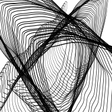
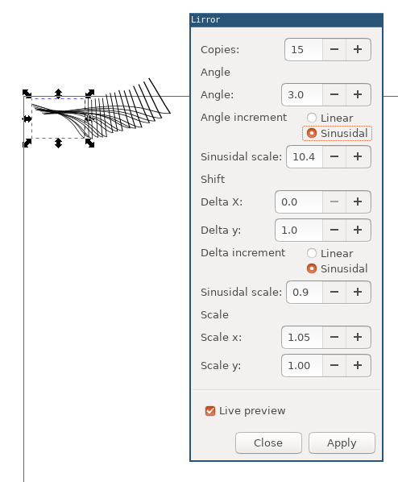

# lirror

Inkscape extension for creating generative art.

The scope of this extension has been kept very minimal. It simply
takes the selected object(s) and creates the specified number of
copies of it. Each new copy will have a cumulative transformation
applied to it where each transformation consists of

- a rotation around 0,0 (top left of the canvas),
- a shift in x and y, and
- a scale operation in x and y.

The rotation and shift operation can be done either lineraly (the same
amount for every copy) or by a sinusidal factor (oscillating for each
copy).

Experimentation is key.